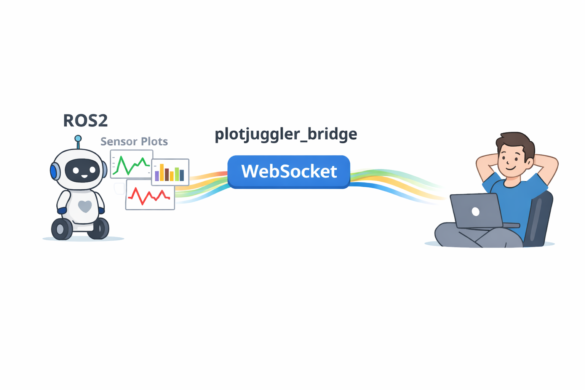

# plotjuggler_bridge



A high-performance bridge server that forwards middleware topic content over WebSocket to PlotJuggler clients. Three backends share a common core:

- **ROS2** (`pj_bridge_ros2`) — ROS2 Humble / Jazzy / Kilted via `rclcpp`
- **FastDDS** (`pj_bridge_fastdds`) — eProsima Fast DDS 3.4 (standalone, no ROS2 required)
- **RTI** (`pj_bridge_rti`) — RTI Connext DDS (build disabled, code preserved)

Even if primarily created for [PlotJuggler](https://github.com/facontidavide/PlotJuggler), this can be considered a general purpose **DDS-to-Websocket bridge** and be used
independently.

## Overview

`pj_bridge` enables clients to subscribe to topics and receive aggregated messages at 50 Hz without needing a full middleware installation. This is useful for visualization tools like PlotJuggler, remote monitoring, and lightweight clients.

### Key Features

- **No ROS required**: if you have PlotJuggler 3.16+ installed on your computer, you don't need ROS installed on it.
- **No DDS Communication**: Clients connect via WebSocket (single port) without needing ROS2/DDS installed
- **High Performance**: 50 Hz message aggregation with ZSTD compression. The original message timestamp is preserved, and less bandwidth is used.
- **Multi-Client Support**: Multiple clients can connect simultaneously with shared subscriptions
- **Runtime Schema Discovery**: Automatic extraction of message schemas from installed ROS2 packages on the server side.
- **Large Message Stripping** (opt-in): Optional stripping of large array fields (Image, PointCloud2, LaserScan, OccupancyGrid) to reduce bandwidth while preserving metadata. Disabled by default — full message data is forwarded; enable with `strip_large_messages:=true` for low-bandwidth links
- **Topic Whitelist**: Restrict which topics are visible/subscribable via full-match regex patterns (`topic_whitelist` / `--topic-whitelist`), mirroring foxglove_bridge's option of the same name
- **QoS Depth Heuristics** (ROS2 only): KEEP_LAST subscription depth is derived from the discovered publishers' depths and clamped to a configurable `[min_qos_depth, max_qos_depth]` range
- **Pushed Topic Advertisement** (opt-in): Clients can subscribe to a `topics_changed` notification instead of polling `get_topics`, at a configurable `topic_poll_interval`
- **Slow-Client Backpressure**: A bounded, drop-oldest per-client send queue (`client_backlog_size`) keeps a lagging client from blocking the publish loop or growing an unbounded backlog, instead of disconnecting it
- **Latched Topic Replay** (ROS2 only): New subscribers to a `TRANSIENT_LOCAL` topic (e.g. `/tf_static`) immediately receive the retained last message instead of waiting for the next publish; such topics are badged `latched: true` in `get_topics`
- **Schemas Up Front** (opt-in): `get_topics`/`subscribe_topic_updates` accept `include_schemas` so demand-driven clients (PlotJuggler 4) can classify topics before subscribing
- **Capability Discovery**: `get_topics` responses identify the server (`name`, `version`) and list its `capabilities`, so clients feature-detect additive protocol features by name — `protocol_version` remains the only hard compatibility gate
- **TLS / `wss://`** (opt-in): Serve the WebSocket endpoint over TLS with a server certificate + private key (`tls`/`--certfile`+`--keyfile`); clients connect via `wss://` instead of `ws://`

## CI Status

|  | Humble | Jazzy | Kilted |
|--|--------|-------|--------|
| **Pixi** | [](https://github.com/PlotJuggler/plotjuggler_bridge/actions/workflows/pixi_humble.yaml) | [](https://github.com/PlotJuggler/plotjuggler_bridge/actions/workflows/pixi_jazzy.yaml) | [](https://github.com/PlotJuggler/plotjuggler_bridge/actions/workflows/pixi_kilted.yaml) |
| **colcon** | [](https://github.com/PlotJuggler/plotjuggler_bridge/actions/workflows/ros_humble.yaml) | [](https://github.com/PlotJuggler/plotjuggler_bridge/actions/workflows/ros_jazzy.yaml) | [](https://github.com/PlotJuggler/plotjuggler_bridge/actions/workflows/ros_kilted.yaml) |

## Configuration Parameters

### ROS2 (via `--ros-args -p`)

| Parameter | Type | Default | Description |
|-----------|------|---------|-------------|
| `port` | int | 9090 | WebSocket server port |
| `publish_rate` | double | 50.0 | Aggregation publish rate in Hz |
| `session_timeout` | double | 10.0 | Client timeout duration in seconds |
| `strip_large_messages` | bool | false | Opt-in: strip large arrays from Image, PointCloud2, LaserScan, OccupancyGrid messages |
| `topic_whitelist` | string array | `[".*"]` | Full-match regex patterns (ECMAScript) restricting visible/subscribable topics |
| `min_qos_depth` | int | 1 | ROS2 only: minimum KEEP_LAST subscription depth after aggregating publisher depths |
| `max_qos_depth` | int | 100 | ROS2 only: maximum KEEP_LAST subscription depth after aggregating publisher depths |
| `topic_poll_interval` | double | 1.0 | Seconds between `topics_changed` notification polls; `0` disables polling |
| `client_backlog_size` | int | 100 | Max binary frames queued per slow client before the oldest is dropped (must be `> 0`) |
| `heavy_frame_threshold_bytes` | int | 262144 | Isolate messages ≥ this size (bytes) into their own size-class frame so they don't starve small topics; `0` disables (must be `>= 0`) |
| `tls` | bool | false | Enable TLS (`wss://`); requires `certfile` and `keyfile` |
| `certfile` | string | `""` | TLS server certificate file |
| `keyfile` | string | `""` | TLS private key file |

### FastDDS / RTI (via CLI flags)

| Flag | Type | Default | Description |
|------|------|---------|-------------|
| `--domains`, `-d` | int list | (required) | DDS domain IDs |
| `--port`, `-p` | int | 9090 | WebSocket server port |
| `--publish-rate` | double | 50.0 | Aggregation publish rate in Hz |
| `--session-timeout` | double | 10.0 | Client timeout duration in seconds |
| `--log-level` | string | `info` | Log level (trace, debug, info, warn, error) |
| `--stats` | flag | off | Print statistics every 5 seconds |
| `--topic-whitelist` | string list | `.*` | Full-match regex patterns (ECMAScript), repeatable |
| `--topic-poll-interval` | double | 1.0 | Seconds between `topics_changed` notification polls; `0` disables polling |
| `--client-backlog-size` | int | 100 | Max binary frames queued per slow client before the oldest is dropped (range `1`-`1000000`) |
| `--heavy-frame-threshold-bytes` | int | 262144 | Isolate messages ≥ this size (bytes) into their own size-class frame; `0` disables (range `0`-`1000000000`) |
| `--certfile` | string | (none) | TLS server certificate file; enables `wss://`, requires `--keyfile` |
| `--keyfile` | string | (none) | TLS private key file; enables `wss://`, requires `--certfile` |
| `--qos-profile` | string | (none) | RTI only: QoS profile XML file path |

## Just "Download and Run"

### Pixi

Install the pre-built package from the [PlotJuggler conda channel](https://prefix.dev/channels/plotjuggler) — no build step required.

```bash
# Install (change humble to jazzy or kilted as needed)
pixi global install pj-bridge-ros2-humble \
  -c https://prefix.dev/plotjuggler -c robostack-humble -c conda-forge

# Run (add arguments if different from default)
pj_bridge_ros2 --ros-args -p port:=9090
```

### AppImage

Pre-built AppImages are available from [GitHub Releases](https://github.com/PlotJuggler/plotjuggler_bridge/releases).

Example for ROS2 Humble:

```bash
# Do once after downloading the file
chmod +x pj_bridge_ros2-humble-x86_64.AppImage

# Run (add arguments if different from default)
./pj_bridge_ros2-humble-x86_64.AppImage --ros-args -p port:=9090
```

## Build Instructions

All dependencies (spdlog, nlohmann_json, ZSTD) are provided by the dependency manager. IXWebSocket is resolved via `find_package` first, with a FetchContent fallback for colcon builds. Only `tl::expected` is vendored.

TLS (`wss://`) support depends on IXWebSocket being built with OpenSSL. The CMake option `PJ_BRIDGE_TLS` (default `ON`) controls this for the FetchContent path (`-DPJ_BRIDGE_TLS=OFF` to disable); a system/conda-provided IXWebSocket must likewise have been built with TLS. See [docs/API.md](docs/API.md#tls--wss) for details.

### ROS2 — Pixi

[Pixi](https://pixi.sh) manages the full toolchain including ROS2 via [RoboStack](https://robostack.github.io/).

From the cloned **plotjuggler_bridge** directory:

```bash
# Build and test (change humble to jazzy or kilted as needed)
pixi run -e humble build
pixi run -e humble test

# Run
pixi shell -e humble
ros2 run pj_bridge pj_bridge_ros2
```

### ROS2 — colcon

Standard ROS2 build using `colcon`. Dependencies are installed via `rosdep`; only IXWebSocket is fetched automatically via CMake FetchContent.

```bash
# Set up workspace
mkdir -p ~/ws_plotjuggler/src && cd ~/ws_plotjuggler/src
git clone https://github.com/PlotJuggler/plotjuggler_bridge && cd plotjuggler_bridge

# Install dependencies
source /opt/ros/${ROS_DISTRO}/setup.bash
rosdep install --from-paths pj_bridge --ignore-src -y

# Build and test
cd ~/ws_plotjuggler
colcon build --packages-select pj_bridge --cmake-args -DCMAKE_BUILD_TYPE=Release
colcon test --packages-select pj_bridge && colcon test-result --verbose

# Run
source install/setup.bash
ros2 run pj_bridge pj_bridge_ros2
```

### FastDDS — Conan

Standalone build using eProsima Fast DDS (no ROS2 required).

From the cloned **plotjuggler_bridge** directory:

```bash
# Build
conan install . --output-folder=build_fastdds --build=missing -s build_type=Release
cd build_fastdds
cmake .. -DCMAKE_BUILD_TYPE=Release -DENABLE_FASTDDS=ON \
         -DCMAKE_TOOLCHAIN_FILE=conan_toolchain.cmake
make -j$(nproc)

# Run
./pj_bridge_fastdds --domains 0 1
```

## Documentation

- For detailed architecture documentation, see [docs/ARCHITECTURE.md](docs/ARCHITECTURE.md).

For the full API protocol documentation (commands, responses, binary wire format), see [docs/API.md](docs/API.md).

## Troubleshooting

### Server fails to start with "Failed to listen on port"

Another process is using the port. Either kill the conflicting process or use a custom port:

```bash
ros2 run pj_bridge pj_bridge_ros2 --ros-args -p port:=9090
```

### Client receives no data

1. Verify server is running: `ps aux | grep pj_bridge`
2. Check topics are being published: `ros2 topic list`
3. Verify heartbeat is being sent (required every 1 second)
4. Check server logs: `ros2 run pj_bridge pj_bridge_ros2 --ros-args --log-level debug`

### "Failed to get schema for topic" error

The message type's .msg file was not found. Ensure the ROS2 package containing the message type is installed and sourced:

```bash
ros2 interface show <package_name>/msg/<MessageType>
```

### Session timeout / Automatic unsubscription

The client stopped sending heartbeats. Ensure the client sends a heartbeat every 1 second. The default timeout is 10 seconds. Increase if needed:

```bash
ros2 run pj_bridge pj_bridge_ros2 --ros-args -p session_timeout:=20.0
```

## License

**pj_bridge** is licensed under the **GNU Affero General Public License v3.0 (AGPL-3.0)**.

Copyright (C) 2026 Davide Faconti

This program is free software: you can redistribute it and/or modify it under the terms of the GNU Affero General Public License as published by the Free Software Foundation, either version 3 of the License, or (at your option) any later version.

See the [LICENSE](LICENSE) file for the full license text.

-----

## License FAQ

### Can I use this software commercially?

**Yes, absolutely.** The AGPL does not restrict commercial use. You can:
- Use pj_bridge in commercial products and services
- Deploy it in production environments for profit

### Does using pj_bridge affect my proprietary software?

**No, it does not.** Because pj_bridge is a **standalone application** that communicates via inter-process communication (WebSocket), it does not impose license restrictions on:
- Your ROS2 nodes and packages
- Client applications connecting to the bridge
- Other software running on the same system
- Proprietary code that publishes to or subscribes from ROS2 topics

### When do I need to share my code?

You must share modifications to pj_bridge only if you:

1. **Distribute** modified versions to others (e.g., shipping a modified binary), OR
2. **Provide the modified software as a network service** to external users

You do **NOT** need to share code if you:
- Use pj_bridge unmodified (even commercially)
- Modify it for internal use only within your organization
- Connect proprietary clients or ROS2 nodes to the bridge

#### What about the AGPL "network" clause?

The AGPL's network provision states that users who interact with the software over a network should have access to the source code. However, this only applies if you:

1. **Modify** the software, AND
2. **Provide it as a service** to external users

#### I'm still concerned about licensing. What should I do?

If you're using pj_bridge **unmodified**, you have nothing to worry about - there are zero licensing obligations.
If still concerned, contact me for alternative licensing options.
