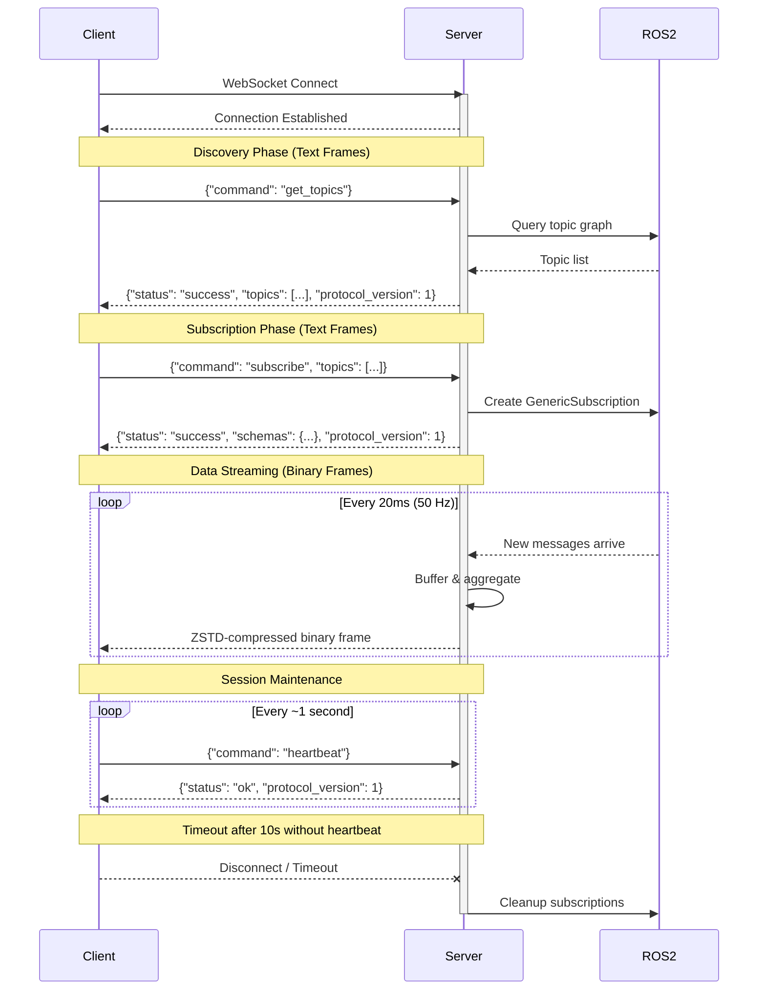

# API Protocol

`pj_ros_bridge` uses a single WebSocket port (default 9090). Text frames carry JSON API requests/responses; binary frames carry ZSTD-compressed aggregated message data.

## Request IDs and Protocol Version

All requests may include an optional `"id"` field (string). All responses include:
- `"protocol_version": 1` - Always present
- `"id"` - Echoed if provided in request

Example:
```json
// Request
{"command": "heartbeat", "id": "req-42"}

// Response
{"status": "ok", "id": "req-42", "protocol_version": 1}
```

## Communication Overview

The diagram below shows the typical client-server interaction:

1. **Connection**: Client connects via WebSocket
2. **Discovery**: Client queries available topics
3. **Subscription**: Client subscribes to topics of interest, receives schemas
4. **Data streaming**: Server pushes aggregated binary data at 50 Hz
5. **Heartbeat**: Client sends periodic heartbeats to maintain the session



## Get Topics

Discover available ROS2 topics.

If a `topic_whitelist` is configured on the server, topics whose name does not
fully match any whitelist pattern are omitted from the response entirely (see
[Topic Whitelist](#topic-whitelist) below).

**Request:**
```json
{"command": "get_topics", "id": "gt1"}
```

**Response:**
```json
{
  "status": "success",
  "id": "gt1",
  "protocol_version": 1,
  "topics": [
    {"name": "/topic_name", "type": "package_name/msg/MessageType"}
  ]
}
```

### Requesting schemas up front (`include_schemas`)

By default `get_topics` returns only `name` + `type` per topic; schemas are
delivered lazily on `subscribe`. A client that needs to classify topics before
subscribing (e.g. by message type *and* schema) can set the optional
`include_schemas` boolean to `true`:

```json
{"command": "get_topics", "id": "gt1", "include_schemas": true}
```

Each topic entry then additionally carries the same `encoding` and
`definition` fields the [subscribe](#subscribe) response uses for schemas:

```json
{
  "status": "success",
  "id": "gt1",
  "protocol_version": 1,
  "topics": [
    {"name": "/topic_name", "type": "package_name/msg/MessageType",
     "encoding": "ros2msg", "definition": "message definition text"}
  ]
}
```

- `encoding` is the backend's schema encoding (`"ros2msg"` for ROS2,
  `"omgidl"` for DDS).
- The flag is purely additive: omitting it (or setting it to `false`) yields
  the byte-for-byte name+type-only response above, so old and new clients
  interoperate with old and new servers without a protocol bump.
- **Per-topic schema failure never drops a topic.** If a topic's schema cannot
  be extracted, that entry is still listed with `name` + `type` only (no
  `encoding`/`definition`); the server logs a warning and continues. Clients
  must therefore treat the schema fields as optional even when they asked for
  them.

## Topic Whitelist

The server can be configured with a list of regex patterns restricting which
topics are visible and subscribable, mirroring foxglove_bridge's
`topic_whitelist` option:

- **ROS2**: string-array parameter `topic_whitelist`, default `[".*"]` (match everything).
- **FastDDS / RTI**: repeatable CLI flag `--topic-whitelist`, default `.*`.

Matching uses **full-match** ECMAScript regex semantics (`std::regex_match`,
not a substring/prefix search): a pattern must match the *entire* topic name.
For example, pattern `/cam` does **not** match `/camera`, but `/camera.*`
matches `/camera` and `/camera/image`. A topic is allowed if it fully matches
**any** configured pattern. An empty pattern list (or the default `.*`)
matches every topic.

Non-whitelisted topics are excluded from `get_topics` responses, and
`subscribe` requests targeting them fail per-topic with reason
`"Topic not whitelisted"` (see below).

## QoS Depth Heuristics (ROS2 only)

When creating a subscription, the ROS2 backend picks a KEEP_LAST history
depth by summing the history depth every discovered publisher on the topic
offers (so a burst from every publisher still fits in the subscription
queue), then clamping the total to a configurable range — the same heuristic
`foxglove_bridge`'s `determineQoS()` uses:

- **ROS2**: int parameters `min_qos_depth` (default `1`) and `max_qos_depth`
  (default `100`).

A publisher that reports depth `0` (KEEP_ALL, or an RMW such as
`rmw_fastrtps_cpp` that does not propagate history depth through discovery)
counts as `100` — the historical default — rather than `0`, so unknown
depths never shrink the queue. If no publishers are discovered yet, the
depth likewise defaults to `min(100, max_qos_depth)`. Both values must be
`>= 0` and `min_qos_depth <= max_qos_depth`; the server refuses to start
otherwise. This is independent of
the subscription's reliability/durability, which is separately adapted to
match what the discovered publishers offer (a RELIABLE subscription still
switches to BEST_EFFORT if any publisher is BEST_EFFORT, and to
TRANSIENT_LOCAL only if every publisher offers it).

## Subscribe

Subscribe to one or more topics. **Breaking change:** Subscribe now uses an additive model - it only adds topics without removing existing subscriptions. Use the `unsubscribe` command to remove topics.

If the server has a `topic_whitelist` configured, requests for topics that
don't fully match any whitelist pattern fail with reason
`"Topic not whitelisted"` — same failure shape as a nonexistent topic (see
[Topic Whitelist](#topic-whitelist)). If every requested topic is rejected
this way, the response is `status: "error"` with
`error_code: "ALL_SUBSCRIPTIONS_FAILED"`.

Each topic in the array can be either a plain string or an object with a `max_rate_hz` field for per-topic rate limiting. Both formats can be mixed in the same request.

When `max_rate_hz` is set, the server decimates messages for that topic, sending at most one message per rate interval (the first eligible buffered message). An explicit value of `0` means unlimited (all messages forwarded). A plain string leaves the rate unspecified: new subscriptions default to unlimited, and re-subscribing to an already-subscribed topic with a plain string preserves its previously configured rate limit.

Rates are clamped server-side to the representable range `[0.001, 1000000]` Hz (values below 0.001 are raised to 0.001; values above 1e6 are lowered to 1e6). The effective rate is echoed in `rate_limits`.

**Request (string-only, backward compatible):**
```json
{
  "command": "subscribe",
  "id": "s1",
  "topics": ["/topic1", "/topic2"]
}
```

**Request (mixed format with rate limiting):**
```json
{
  "command": "subscribe",
  "id": "s2",
  "topics": [
    "/topic_unlimited",
    {"name": "/topic_limited", "max_rate_hz": 10.0}
  ]
}
```

**Response (success):**
```json
{
  "status": "success",
  "id": "s1",
  "protocol_version": 1,
  "schemas": {
    "/topic_unlimited": {"encoding": "ros2msg", "definition": "message definition text"},
    "/topic_limited": {"encoding": "ros2msg", "definition": "message definition text"}
  },
  "rate_limits": {
    "/topic_limited": 10.0
  }
}
```

The `rate_limits` field is only present when at least one topic has a non-zero rate limit. It maps topic names to their configured `max_rate_hz`.

**Response (partial success):**
```json
{
  "status": "partial_success",
  "id": "s1",
  "protocol_version": 1,
  "message": "Some subscriptions failed",
  "schemas": {"/topic1": {"encoding": "ros2msg", "definition": "..."}},
  "failures": [
    {"topic": "/topic2", "reason": "Topic does not exist"}
  ]
}
```

## Latched topics (transient_local)

*ROS2 backend only, for now.*

When a topic's publishers all offer `TRANSIENT_LOCAL` durability (e.g.
`/tf_static`, `/robot_description`), the bridge treats it as **latched**. A
brand-new subscription receives the publisher's retained sample directly
from DDS, but the bridge's underlying middleware subscription is shared and
reference-counted across clients — a client subscribing to a topic that
another client is *already* subscribed to does not create a new DDS
subscription, so it would otherwise have to wait for the next publish (which,
for a latched topic like `/tf_static`, may never come).

To cover this case, the bridge retains the most recent message for each
latched topic outside the normal 1-second message buffer. Immediately after
a successful `subscribe` response, the server sends one extra binary frame
per newly-subscribed latched topic containing just that retained message —
same [Binary Message Format](#binary-message-format) as regular aggregated
frames, just with a single message and the original (possibly "stale")
timestamp from when it was received. No client-side handling is required
beyond decoding it like any other binary frame.

Only the single newest sample per latched topic is retained (bounded memory
use), and only for topics that have had at least one subscriber — the
first subscriber's DDS-native delivery is what seeds the retained copy for
later subscribers. When the last subscriber of a latched topic leaves
(unsubscribe, pause, or disconnect), the retained sample is discarded along
with the underlying subscription: the next subscriber gets the current
sample from DDS redelivery, never a stale copy.

Replay also happens on `resume` for latched topics whose subscription
reference is re-acquired at that point (i.e. topics that were subscribed
while the client was paused): the replay frame is delivered right after the
resume response, exactly like the post-subscribe case.

No replay frame is sent when the retained message is still pending in the
regular aggregation buffer — in that case the next aggregated frame delivers
it to the new subscriber anyway, and a replay would duplicate it. Replay
frames intentionally bypass per-topic rate limiting (`max_rate_hz`) and are
not counted in the server's publish statistics. They are, however, subject
to the same [slow-client backpressure](#slow-clients--backpressure) queueing
as regular aggregated frames: a replay destined for an already-slow client
may be delayed until the next send attempt for that client (and, like any
queued frame, can be dropped if the backlog overflows).

## Unsubscribe

Remove topics from subscription. Only removes specified topics; other subscriptions are preserved.

**Request:**
```json
{"command": "unsubscribe", "id": "u1", "topics": ["/topic1", "/topic2"]}
```

**Response:**
```json
{
  "status": "success",
  "id": "u1",
  "protocol_version": 1,
  "removed": ["/topic1", "/topic2"]
}
```

Topics not currently subscribed are silently ignored.

## Pause / Resume

Pause stops binary frame delivery to the client. Subscriptions and rate limits are preserved — including topics whose publisher disappears while paused: they stay subscribed and are re-acquired on a later resume once the publisher is back.
Resume restarts binary frame delivery.

**Pause Request:**
```json
{"command": "pause", "id": "p1"}
```

**Pause Response:**
```json
{"status": "ok", "id": "p1", "protocol_version": 1, "paused": true}
```

**Resume Request:**
```json
{"command": "resume", "id": "r1"}
```

**Resume Response:**
```json
{"status": "ok", "id": "r1", "protocol_version": 1, "paused": false}
```

If some subscribed topics are not currently available (publisher down) or fail to re-subscribe at resume time, the response includes an `unavailable_topics` array listing them. These subscriptions are kept and re-acquired on a later resume:
```json
{"status": "ok", "id": "r1", "protocol_version": 1, "paused": false, "unavailable_topics": ["/camera/image"]}
```

Both commands are idempotent. Smart ROS2 management: when all clients interested in a topic are paused, the ROS2 subscription is released.

## Pushed Topic Advertisement (topics_changed)

Clients can opt in to be notified when the server's (whitelist-filtered)
topic set changes, instead of polling `get_topics`.

**Subscribe Request:**
```json
{"command": "subscribe_topic_updates", "id": "tu1"}
```

**Subscribe Response:**
```json
{"status": "ok", "id": "tu1", "protocol_version": 1, "topic_updates": true}
```

The request accepts the same optional `include_schemas` boolean as
[`get_topics`](#requesting-schemas-up-front-include_schemas). When set to
`true`, this session's `topics_changed` notifications carry per-topic schemas
on their `added` entries (see below):

```json
{"command": "subscribe_topic_updates", "id": "tu1", "include_schemas": true}
```

The flag is stored per session and always taken from the latest
`subscribe_topic_updates` request, so re-subscribing without it reverts to the
name+type-only notification shape. It is independent of `topic_updates`
itself — it only changes the shape of notifications, never whether they are
sent.

**Unsubscribe Request:**
```json
{"command": "unsubscribe_topic_updates", "id": "tu2"}
```

**Unsubscribe Response:**
```json
{"status": "ok", "id": "tu2", "protocol_version": 1, "topic_updates": false}
```

Both commands are idempotent and create a session if the client does not
already have one (like `pause`/`resume`).

The server periodically polls the topic graph (see `topic_poll_interval`
below) and, for every session currently opted in, sends a **notification**
(not a response to any request — it has no `id`) whenever the topic set has
changed since the last poll:

```json
{"notification": "topics_changed",
 "added": [{"name": "/t", "type": "pkg/msg/T"}],
 "removed": ["/gone"],
 "protocol_version": 1}
```

For sessions that opted in with `include_schemas: true`, each `added` entry
additionally carries `encoding` + `definition` (the same fields as
[`get_topics`](#requesting-schemas-up-front-include_schemas) /
[subscribe](#subscribe)); `removed` entries are unchanged (bare names):

```json
{"notification": "topics_changed",
 "added": [{"name": "/t", "type": "pkg/msg/T",
            "encoding": "ros2msg", "definition": "message definition text"}],
 "removed": ["/gone"],
 "protocol_version": 1}
```

- `added` and `removed` may each be empty, but a notification is only sent
  when at least one of them is non-empty.
- A topic whose type changes (same name, different type) is reported as both
  removed and added.
- **Per-topic schema failure never drops a topic** (same as `get_topics`): an
  `added` entry whose schema cannot be extracted is delivered with `name` +
  `type` only, no `encoding`/`definition`. Clients must treat the schema
  fields as optional even when they opted in.
- Only whitelisted topics (see [Topic Whitelist](#topic-whitelist)) are
  considered — a non-whitelisted topic appearing or disappearing never
  triggers a notification.
- The very first poll after the server starts never sends a notification (it
  only establishes the initial snapshot); notifications begin from the
  second poll onward.
- **Clients must tolerate unknown `notification` types** appearing in future
  protocol versions and ignore ones they don't recognize.

The poll interval is configurable:
- **ROS2**: double parameter `topic_poll_interval`, default `1.0` seconds. `0` disables polling entirely.
- **FastDDS / RTI**: CLI flag `--topic-poll-interval`, default `1.0` seconds. `0` disables polling entirely.

## Heartbeat

Clients must send a heartbeat at least once per second. The default timeout is 10 seconds.

**Request:**
```json
{"command": "heartbeat", "id": "hb1"}
```

**Response:**
```json
{"status": "ok", "id": "hb1", "protocol_version": 1}
```

## Error Response

All commands may return an error:

```json
{
  "status": "error",
  "id": "req-id",
  "protocol_version": 1,
  "error_code": "ERROR_CODE",
  "message": "Human readable error message"
}
```

Error codes: `INVALID_REQUEST`, `INVALID_JSON`, `UNKNOWN_COMMAND`, `ALL_SUBSCRIPTIONS_FAILED`, `INTERNAL_ERROR`.

## Slow clients / backpressure

If a client can't keep up with the aggregated-message stream (e.g. a slow
network link or a busy renderer), the server never blocks the publish loop
waiting for it and never disconnects it for falling behind — matching
foxglove_bridge's slow-client policy. Instead, once a client's outgoing
socket buffer exceeds a 1 MiB high watermark, new binary frames destined for
that client are held in a small per-client queue rather than sent
immediately. If that queue is already full, the **oldest** queued frame is
dropped to make room for the newest one, so a lagging client always
eventually resumes with fresh data instead of a growing backlog of stale
frames. Queued frames are delivered, in order, on the **next send attempt**
for that client once its socket buffer has drained back below the watermark
(there is no background flush timer — if the client's topics go quiet, the
backlog waits for the next frame destined for that client). The JSON
control-plane (requests and their replies, including `heartbeat`) is never
affected — those messages are always sent immediately. If a client's session
times out server-side while its socket stays open, any backlog still queued
for it is discarded.

Frames already queued (or already sitting in the socket's send buffer) when
an `unsubscribe` is processed may still arrive **after** the unsubscribe
response — clients must tolerate binary messages for recently-unsubscribed
topics. This is inherent to socket buffering, not specific to the backlog
queue.

The queue depth (max frames held per client before the oldest is dropped) is
configurable:

- **ROS2**: int parameter `client_backlog_size`, default `100`. Must be `> 0`;
  the server refuses to start otherwise.
- **FastDDS / RTI**: CLI flag `--client-backlog-size`, default `100`, valid
  range `1`-`1000000`.

## TLS / wss://

The bridge can optionally serve the WebSocket endpoint over TLS (`wss://`)
using a server certificate + private key (OpenSSL). Client certificate
verification is not supported — this is server-authentication only.

TLS support depends on IXWebSocket having been built with OpenSSL
(`PJ_BRIDGE_TLS=ON`, the CMake default for FetchContent builds; a
system/conda-provided IXWebSocket must likewise have been built with TLS —
check for `IXWEBSOCKET_USE_TLS` in its exported CMake target). If TLS is
requested but the linked IXWebSocket lacks TLS support, the server fails to
start with an explicit error instead of silently falling back to plaintext.

Configuration:

- **ROS2**: parameters `tls` (bool, default `false`), `certfile` (string,
  default `""`), `keyfile` (string, default `""`). Setting `tls: true`
  without both `certfile` and `keyfile` set is a startup error.
- **FastDDS / RTI**: CLI flags `--certfile <path>` and `--keyfile <path>`.
  Passing one without the other is a CLI11 parse error (`->needs()`); passing
  both enables TLS.

Note that only certificate/key file *readability* is validated at startup; a
mismatched certificate/key pair is not detected until clients connect, and
then only surfaces as per-connection TLS handshake failures in the server
log (IXWebSocket defers TLS setup to accept time).

Example: generate a self-signed certificate and start the ROS2 backend with
TLS enabled:

```bash
openssl req -x509 -newkey rsa:2048 -keyout key.pem -out cert.pem -days 365 -nodes -subj "/CN=localhost"

ros2 run pj_bridge pj_bridge_ros2 --ros-args \
  -p tls:=true -p certfile:=cert.pem -p keyfile:=key.pem
```

Clients then connect via `wss://` instead of `ws://` (e.g.
`wss://127.0.0.1:9090`). With a self-signed certificate, the client must
either trust the certificate explicitly or disable peer verification (e.g.
IXWebSocket's `caFile = "NONE"`) — production deployments should use a
certificate signed by a trusted CA instead.

## Binary Message Format

Binary frames consist of a fixed 16-byte header followed by ZSTD-compressed payload.

### Header (16 bytes, little-endian, uncompressed)

| Offset | Size | Field | Description |
|--------|------|-------|-------------|
| 0 | 4 | magic | `0x42524A50` ("PJRB") |
| 4 | 4 | message_count | Number of messages in frame |
| 8 | 4 | uncompressed_size | Payload size before compression |
| 12 | 4 | flags | Reserved (must be 0) |

### Payload (ZSTD-compressed)

The compressed payload contains messages in sequence:

```
For each message:
  - Topic name length  (uint16_t, little-endian)
  - Topic name         (N bytes, UTF-8)
  - Timestamp          (uint64_t, nanoseconds since epoch, little-endian)
  - Message data length (uint32_t, little-endian)
  - Message data       (N bytes, CDR-serialized from ROS2)
```

The magic bytes allow clients to validate frame integrity before decompression.
