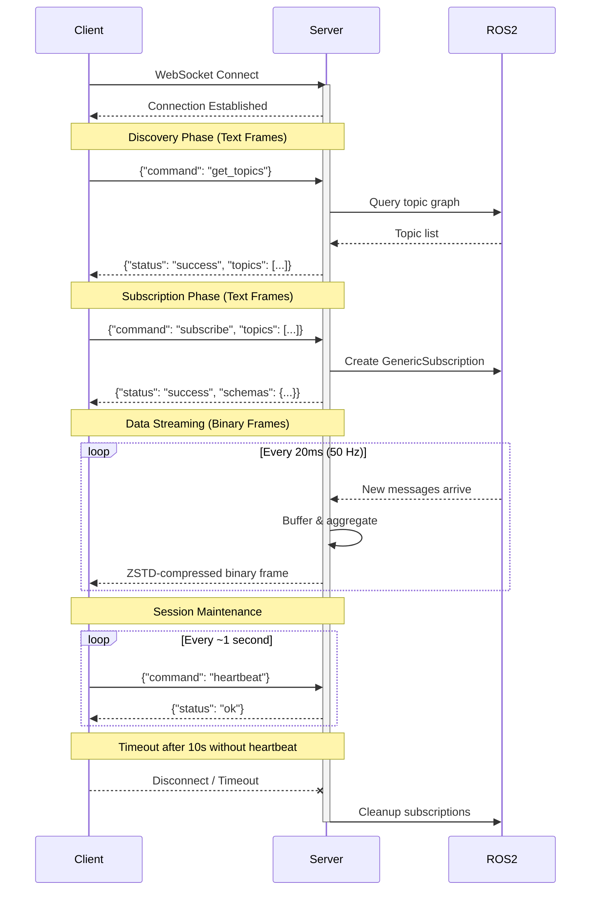

# API Protocol

`pj_ros_bridge` uses a single WebSocket port (default 8080). Text frames carry JSON API requests/responses; binary frames carry ZSTD-compressed aggregated message data.

## Communication Overview

The diagram below shows the typical client-server interaction:

1. **Connection**: Client connects via WebSocket
2. **Discovery**: Client queries available topics
3. **Subscription**: Client subscribes to topics of interest, receives schemas
4. **Data streaming**: Server pushes aggregated binary data at 50 Hz
5. **Heartbeat**: Client sends periodic heartbeats to maintain the session



## Get Topics

Discover available ROS2 topics.

**Request:**
```json
{"command": "get_topics"}
```

**Response:**
```json
{
  "status": "success",
  "topics": [
    {"name": "/topic_name", "type": "package_name/msg/MessageType"}
  ]
}
```

## Subscribe

Subscribe to one or more topics. The server performs a diff against the client's current subscriptions: new topics are added, omitted topics are removed.

Each topic in the array can be either a plain string (unlimited rate) or an object with a `max_rate_hz` field for per-topic rate limiting. Both formats can be mixed in the same request.

When `max_rate_hz` is set, the server decimates messages for that topic, sending at most one message per rate interval (the latest available). A value of `0` or omitting the field means unlimited (all messages forwarded).

**Request (string-only, backward compatible):**
```json
{
  "command": "subscribe",
  "topics": ["/topic1", "/topic2"]
}
```

**Request (mixed format with rate limiting):**
```json
{
  "command": "subscribe",
  "topics": [
    "/topic_unlimited",
    {"name": "/topic_limited", "max_rate_hz": 10.0}
  ]
}
```

**Response (success):**
```json
{
  "status": "success",
  "schemas": {
    "/topic_unlimited": "message definition text",
    "/topic_limited": "message definition text"
  },
  "rate_limits": {
    "/topic_limited": 10.0
  }
}
```

The `rate_limits` field is only present when at least one topic has a non-zero rate limit. It maps topic names to their configured `max_rate_hz`.

**Response (partial success):**
```json
{
  "status": "partial_success",
  "message": "Some subscriptions failed",
  "schemas": {"/topic1": "..."},
  "failures": [
    {"topic": "/topic2", "reason": "Topic does not exist"}
  ]
}
```

## Heartbeat

Clients must send a heartbeat at least once per second. The default timeout is 10 seconds.

**Request:**
```json
{"command": "heartbeat"}
```

**Response:**
```json
{"status": "ok"}
```

## Error Response

All commands may return an error:

```json
{
  "status": "error",
  "error_code": "ERROR_CODE",
  "message": "Human readable error message"
}
```

Error codes: `INVALID_REQUEST`, `INVALID_JSON`, `UNKNOWN_COMMAND`, `ALL_SUBSCRIPTIONS_FAILED`, `INTERNAL_ERROR`.

## Binary Message Format

Aggregated messages are sent as ZSTD-compressed binary WebSocket frames at the configured publish rate (default 50 Hz). Each client receives only messages for its subscribed topics.

The decompressed payload is a sequence of messages with no header:

```
For each message:
  - Topic name length  (uint16_t, little-endian)
  - Topic name         (N bytes, UTF-8)
  - Timestamp          (uint64_t, nanoseconds since epoch, little-endian)
  - Message data length (uint32_t, little-endian)
  - Message data       (N bytes, CDR-serialized from ROS2)
```

Messages are serialized directly in sequence (streaming format). ZSTD compression level 1 is applied to the entire buffer before transmission.
