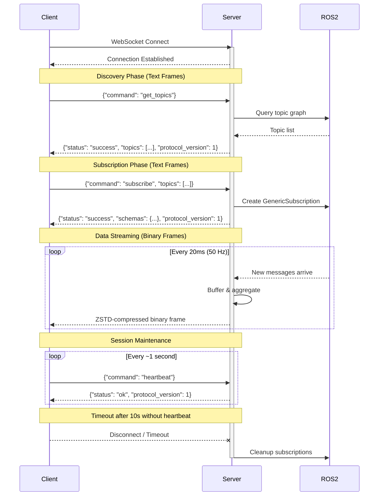

# API Protocol

`pj_ros_bridge` uses a single WebSocket port (default 9090). Text frames carry JSON API requests/responses; binary frames carry ZSTD-compressed aggregated message data.

## Request IDs and Protocol Version

All requests may include an optional `"id"` field (string). All responses include:
- `"protocol_version": 1` - Always present
- `"id"` - Echoed if provided in request

Example:
```json
// Request
{"command": "heartbeat", "id": "req-42"}

// Response
{"status": "ok", "id": "req-42", "protocol_version": 1}
```

## Communication Overview

The diagram below shows the typical client-server interaction:

1. **Connection**: Client connects via WebSocket
2. **Discovery**: Client queries available topics
3. **Subscription**: Client subscribes to topics of interest, receives schemas
4. **Data streaming**: Server pushes aggregated binary data at 50 Hz
5. **Heartbeat**: Client sends periodic heartbeats to maintain the session



## Get Topics

Discover available ROS2 topics.

If a `topic_whitelist` is configured on the server, topics whose name does not
fully match any whitelist pattern are omitted from the response entirely (see
[Topic Whitelist](#topic-whitelist) below).

**Request:**
```json
{"command": "get_topics", "id": "gt1"}
```

**Response:**
```json
{
  "status": "success",
  "id": "gt1",
  "protocol_version": 1,
  "topics": [
    {"name": "/topic_name", "type": "package_name/msg/MessageType"}
  ]
}
```

## Topic Whitelist

The server can be configured with a list of regex patterns restricting which
topics are visible and subscribable, mirroring foxglove_bridge's
`topic_whitelist` option:

- **ROS2**: string-array parameter `topic_whitelist`, default `[".*"]` (match everything).
- **FastDDS / RTI**: repeatable CLI flag `--topic-whitelist`, default `.*`.

Matching uses **full-match** ECMAScript regex semantics (`std::regex_match`,
not a substring/prefix search): a pattern must match the *entire* topic name.
For example, pattern `/cam` does **not** match `/camera`, but `/camera.*`
matches `/camera` and `/camera/image`. A topic is allowed if it fully matches
**any** configured pattern. An empty pattern list (or the default `.*`)
matches every topic.

Non-whitelisted topics are excluded from `get_topics` responses, and
`subscribe` requests targeting them fail per-topic with reason
`"Topic not whitelisted"` (see below).

## QoS Depth Heuristics (ROS2 only)

When creating a subscription, the ROS2 backend picks a KEEP_LAST history
depth by summing the history depth every discovered publisher on the topic
offers (so a burst from every publisher still fits in the subscription
queue), then clamping the total to a configurable range — the same heuristic
`foxglove_bridge`'s `determineQoS()` uses:

- **ROS2**: int parameters `min_qos_depth` (default `1`) and `max_qos_depth`
  (default `100`).

If no publishers are discovered yet, the depth defaults to `min(100,
max_qos_depth)`. Both values must be `>= 0` and `min_qos_depth <=
max_qos_depth`; the server refuses to start otherwise. This is independent of
the subscription's reliability/durability, which is separately adapted to
match what the discovered publishers offer (a RELIABLE subscription still
switches to BEST_EFFORT if any publisher is BEST_EFFORT, and to
TRANSIENT_LOCAL only if every publisher offers it).

## Subscribe

Subscribe to one or more topics. **Breaking change:** Subscribe now uses an additive model - it only adds topics without removing existing subscriptions. Use the `unsubscribe` command to remove topics.

If the server has a `topic_whitelist` configured, requests for topics that
don't fully match any whitelist pattern fail with reason
`"Topic not whitelisted"` — same failure shape as a nonexistent topic (see
[Topic Whitelist](#topic-whitelist)). If every requested topic is rejected
this way, the response is `status: "error"` with
`error_code: "ALL_SUBSCRIPTIONS_FAILED"`.

Each topic in the array can be either a plain string or an object with a `max_rate_hz` field for per-topic rate limiting. Both formats can be mixed in the same request.

When `max_rate_hz` is set, the server decimates messages for that topic, sending at most one message per rate interval (the first eligible buffered message). An explicit value of `0` means unlimited (all messages forwarded). A plain string leaves the rate unspecified: new subscriptions default to unlimited, and re-subscribing to an already-subscribed topic with a plain string preserves its previously configured rate limit.

Rates are clamped server-side to the representable range `[0.001, 1000000]` Hz (values below 0.001 are raised to 0.001; values above 1e6 are lowered to 1e6). The effective rate is echoed in `rate_limits`.

**Request (string-only, backward compatible):**
```json
{
  "command": "subscribe",
  "id": "s1",
  "topics": ["/topic1", "/topic2"]
}
```

**Request (mixed format with rate limiting):**
```json
{
  "command": "subscribe",
  "id": "s2",
  "topics": [
    "/topic_unlimited",
    {"name": "/topic_limited", "max_rate_hz": 10.0}
  ]
}
```

**Response (success):**
```json
{
  "status": "success",
  "id": "s1",
  "protocol_version": 1,
  "schemas": {
    "/topic_unlimited": {"encoding": "ros2msg", "definition": "message definition text"},
    "/topic_limited": {"encoding": "ros2msg", "definition": "message definition text"}
  },
  "rate_limits": {
    "/topic_limited": 10.0
  }
}
```

The `rate_limits` field is only present when at least one topic has a non-zero rate limit. It maps topic names to their configured `max_rate_hz`.

**Response (partial success):**
```json
{
  "status": "partial_success",
  "id": "s1",
  "protocol_version": 1,
  "message": "Some subscriptions failed",
  "schemas": {"/topic1": {"encoding": "ros2msg", "definition": "..."}},
  "failures": [
    {"topic": "/topic2", "reason": "Topic does not exist"}
  ]
}
```

## Unsubscribe

Remove topics from subscription. Only removes specified topics; other subscriptions are preserved.

**Request:**
```json
{"command": "unsubscribe", "id": "u1", "topics": ["/topic1", "/topic2"]}
```

**Response:**
```json
{
  "status": "success",
  "id": "u1",
  "protocol_version": 1,
  "removed": ["/topic1", "/topic2"]
}
```

Topics not currently subscribed are silently ignored.

## Pause / Resume

Pause stops binary frame delivery to the client. Subscriptions and rate limits are preserved — including topics whose publisher disappears while paused: they stay subscribed and are re-acquired on a later resume once the publisher is back.
Resume restarts binary frame delivery.

**Pause Request:**
```json
{"command": "pause", "id": "p1"}
```

**Pause Response:**
```json
{"status": "ok", "id": "p1", "protocol_version": 1, "paused": true}
```

**Resume Request:**
```json
{"command": "resume", "id": "r1"}
```

**Resume Response:**
```json
{"status": "ok", "id": "r1", "protocol_version": 1, "paused": false}
```

If some subscribed topics are not currently available (publisher down) or fail to re-subscribe at resume time, the response includes an `unavailable_topics` array listing them. These subscriptions are kept and re-acquired on a later resume:
```json
{"status": "ok", "id": "r1", "protocol_version": 1, "paused": false, "unavailable_topics": ["/camera/image"]}
```

Both commands are idempotent. Smart ROS2 management: when all clients interested in a topic are paused, the ROS2 subscription is released.

## Heartbeat

Clients must send a heartbeat at least once per second. The default timeout is 10 seconds.

**Request:**
```json
{"command": "heartbeat", "id": "hb1"}
```

**Response:**
```json
{"status": "ok", "id": "hb1", "protocol_version": 1}
```

## Error Response

All commands may return an error:

```json
{
  "status": "error",
  "id": "req-id",
  "protocol_version": 1,
  "error_code": "ERROR_CODE",
  "message": "Human readable error message"
}
```

Error codes: `INVALID_REQUEST`, `INVALID_JSON`, `UNKNOWN_COMMAND`, `ALL_SUBSCRIPTIONS_FAILED`, `INTERNAL_ERROR`.

## Binary Message Format

Binary frames consist of a fixed 16-byte header followed by ZSTD-compressed payload.

### Header (16 bytes, little-endian, uncompressed)

| Offset | Size | Field | Description |
|--------|------|-------|-------------|
| 0 | 4 | magic | `0x42524A50` ("PJRB") |
| 4 | 4 | message_count | Number of messages in frame |
| 8 | 4 | uncompressed_size | Payload size before compression |
| 12 | 4 | flags | Reserved (must be 0) |

### Payload (ZSTD-compressed)

The compressed payload contains messages in sequence:

```
For each message:
  - Topic name length  (uint16_t, little-endian)
  - Topic name         (N bytes, UTF-8)
  - Timestamp          (uint64_t, nanoseconds since epoch, little-endian)
  - Message data length (uint32_t, little-endian)
  - Message data       (N bytes, CDR-serialized from ROS2)
```

The magic bytes allow clients to validate frame integrity before decompression.
